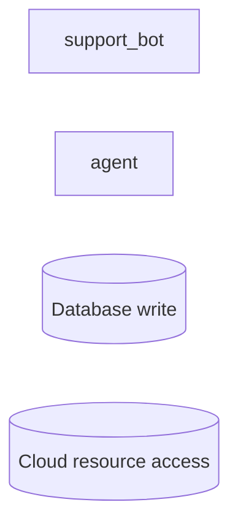

# Walkthrough: the full Stoa surface on a fintech agent backend

An extensive, verified tour of `stoa` against **Meridian** — a fictional
neobank's multi-agent backend, engineered so a single `scan` + `diff` +
`approve` touches nearly every feature Stoa has. Every command below was
actually run against this fixture (Stoa `0.4.0`); every output snippet is a
real capture, not illustrative. `run-e2e.sh` asserts 63 checks covering the
same ground as automated regression — this document is the narrated version.

**Using this for a demo video:** if you only have a few minutes, Parts 1, 4,
and 6 are the highest-signal stops — breadth of detection, the contradiction
detector (the differentiator), and the assurance packet (the enterprise
hook). Parts 2, 3, 5, 7–10 are the depth behind them.

```bash
pipx install stoa-agent-risk
cd examples/meridian-ops
```

---

## Part 1 — What gets found (detection breadth)

```bash
stoa scan .
```

```
stoa 0.4.0 — scanned 14 files
Agent candidates: 12 (8 high confidence)
Findings: 7 critical, 9 high, 14 medium, 7 low, 23 info (3 suppressed)
```

**Eight agent frameworks, two languages, one MCP server, in one repo:**

| Framework | Agent | Language |
|---|---|---|
| LangChain + LangGraph | `compliance_agent` | Python |
| LangChain | `payments` (agent + executor) | Python |
| CrewAI | `fraud` (`analyst`, `crew`) | Python |
| Agno | `devops` | Python |
| OpenAI Agents SDK | `research_agent` | Python |
| PydanticAI | `triage_agent` | Python |
| AutoGen | `campaigner` (marketing) | Python |
| Vercel AI SDK / hand-rolled | `support_bot` | **TypeScript** |
| MCP server | `script_tools` | Python |

**Twelve capabilities detected**, from tool-calling to the ones that actually
move things: `payment_access`, `database_write`, `shell_execution`,
`cloud_resource_access`, `email_send`, `messaging`, `external_http`,
`web_search`, `vector_search`, `mcp_tools`, `customer_support`,
`tool_calling`.

**Seven real-world integrations recognized:** Stripe, Postgres, Zendesk,
Slack, SendGrid, Pinecone, AWS.

**Precision controls (what correctly does *not* fire):**
- `lib/embeddings.py` — an OpenAI import and a single embeddings call, no
  agentic construct → **not flagged as an agent.**
- `lib/user_agent.py` — a `UserAgentParser` class → **not flagged**, despite
  the generic `*Agent`-adjacent name.
- `lib/db.py` — a parameterized query (`%s` placeholder) → **no SEC003
  noise**, right next to a real interpolated query three lines later that
  *is* suppressed inline with a reason (see Part 8).

## Part 2 — Every rule family, fired for real

**Core rules** (pattern-based, not AI-specific):

| Rule | Fired on | Note |
|---|---|---|
| SEC001 (hardcoded credential) | `payments.py` | critical, gate-eligible at high confidence |
| SEC003 (interpolated SQL) | `payments.py` | superseded by AI002/sql at the same line (dedup, not double-counted) |
| REL001 (swallowed exception) | `fraud.py` | suppressed inline, still counted |
| NET002 (missing timeout) | multiple | severity overridden to `info` via `stoa.toml` |
| CTRL001/002/004 | — | **absent** — a control is observed *somewhere* in the repo, so per-file "not observed" noise is suppressed repo-wide |
| CTRL003 | — | **disabled** via `stoa.toml` (rate limiting enforced at the gateway, not per-agent) |

**AI rules** (OWASP LLM Top 10 — see the [rules overview](https://stoa-agent-risk.dev/docs/rules) for the full taxonomy):

| Rule | Depth demonstrated |
|---|---|
| AI001 | prompt-injection ingress (retrieval → prompt in `fraud.py`) |
| **AI002** | all **four sink classes** in one registry: `exec` (payments, gate-eligible), `sql` (payments, supersedes SEC003), `markup` (support_bot), `request` |
| AI003 | tool-bound high-impact capability, no approval construct (`payments.py:12`) |
| AI004 | PII → prompt (`payments.py` — SSN interpolated into an ops-command draft) |
| **AI005** | all **four variants**: `trust-remote-code` + `unpinned-artifact` (research), `floating-alias` (payments), `insecure-endpoint` (devops, supersedes NET001) |
| AI006 | secret → network egress (`fraud.py`) |
| AI007 | no sampling bound near a high-impact call |

Every AI001/002/004/006 finding carries a redacted **`flow` array** —
source → propagation → sink, e.g.:

```json
"flow": [
  {"role": "source", "line": 22, "snippet": "customer['ssn']"},
  {"role": "sink", "line": 23, "snippet": "subprocess.run(reply, shell=True)"}
]
```

## Part 3 — The Dimension Exposure Matrix

Eight dimensions, grouped under the six standard categories of
[AIUC-1](https://www.aiuc-1.com/) — the published AI agent trust standard,
not a house rubric:

| Group | Dimension | This scan |
|---|---|---|
| A — Data & Privacy | Boundary leakage | **elevated** (4 agents) |
| B — Security | Mandate overreach | **elevated** (3 agents) |
| B — Security | Injection & tamper surface | moderate (3) |
| B — Security | Control coverage gap | moderate (3) |
| C — Safety | Unreviewed high-impact action | **elevated** (3 agents) |
| D — Reliability | Output fidelity | **elevated** (2 agents) |
| D — Reliability | Conduct variability (proxy) | low |
| D — Reliability | Dependency drift (proxy) | low |

The two proxy dimensions never reach elevated — capped by design, since a
config signal (an unpinned model string) is not proof of runtime behavior.
Groups **E (Accountability)** and **F (Society)** have no row here on
purpose: static analysis can't assess vendor due diligence or societal-scale
misuse; those live entirely in the assurance packet (Part 6).

**The good-news path** — `compliance_agent` is deliberately well-controlled,
and the report says so: all six observable control types credit its score —
`approval`, `authentication`, `validation`, `deterministic_sampling`,
`pinned_model`, `observability`. Contrast, not just a wall of red.

## Part 4 — The autonomy ladder, and the headline: the contradiction detector

Every agent lands on a five-level autonomy ladder inferred from static
signals — Meridian demonstrates three of them directly (`bounded_autonomous`
and `indeterminate` are demonstrated in
[examples/threshold-voice](../threshold-voice)):

| Level | Agent(s) | Why |
|---|---|---|
| `recommend_only` | 9 of 12 candidates | no side-effecting model-output path found |
| `unrestricted_autonomous` | `payments`, `support_bot` | a real sink (exec/sql/markup), no approval, no bounding |

**This is where a self-attested questionnaire loses to a same-run
cross-check.** `stoa-declared.toml` declares both of these as safer than
they are:

```
DECL001 critical  web/support_bot.ts:12
  declared: agents."2e0ab9a50e4e".autonomy_intent = "recommend_only"
  inferred: unrestricted_autonomous

DECL001 critical  agents/payments.py:23
  declared: agents."a09ff38687e9".autonomy_intent = "human_approved"
  inferred: unrestricted_autonomous

DECL004 high      agents/payments.py:8
  payments touches authentication-class data (a leaked credential) that
  isn't in its declared data_classes
```

Two independent declared-vs-scanned contradictions, on the two agents that
matter most (customer-facing chat, money movement), both gate-eligible. Open
the HTML report's **Contradictions** section for the code evidence and the
exact declaration key, side by side, for every one of these.

## Part 5 — Did anything's reach change? (`stoa diff` + `stoa approve`)

Comparing a base commit against a head commit that adds one agent and
escalates two more (`run-e2e.sh` builds this scenario in a throwaway git
repo — see its top for the exact recipe):

```bash
stoa diff --base-ref <base> --md changelog.md
```

```
## Stoa · Agent Changelog — ⚠️ 2 unapproved high-severity drift

### ⬆️ Capability escalations
| Agent | Change | Location | Drift | Approved |
|---|---|---|---|---|
| support_bot | + messaging (high-impact) | web/support_bot.ts | 🔴 high | ❌ |
| support_bot | + slack integration | web/support_bot.ts | 🟡 medium | ❌ |
| agent | + cloud_resource_access (high-impact) | agents/devops.py | 🔴 high | ❌ |

### 🆕 New agents
| campaigner | medium | email_send | sendgrid | 🔴 high |

### 🩺 Finding delta on changed agents
- New critical — DECL001 at web/support_bot.ts:12 (gate-eligible)
```

Note the **`dimension_delta`** riding along with each escalation — `devops`
gaining `cloud_resource_access` moves its `mandate-overreach` score from
`low` to `moderate`, not just "a capability changed":

```json
{"id": "mandate-overreach", "from": "low", "to": "moderate", "direction": "increased"}
```

```bash
stoa diff --base-ref <base> --fail-on-drift high   # exit 1 — unapproved escalation
stoa approve --agent devops --capability cloud_resource_access \
  --reason "ECS restart, reviewed SEC-1234" --by @sre-oncall
```

`.stoa/approvals.toml` is written, CODEOWNERS-protected, reviewed like code —
re-running the diff with that approval in place drops the gate.

## Part 6 — The assurance packet: 18 areas, nothing silently omitted

```bash
stoa export --assurance registry.json --format md
```

```
## Stoa · Assurance Packet — meridian-ops
12 agent(s) · 13 contradiction(s)
```

Every one of 18 areas is explicitly `scanned`, `declared`, `ingested`, or
**`not_provided`** — a gap is output, never a missing row:

| # | Area | Provenance |
|---|---|---|
| 1 | AI inventory | scanned + declared |
| 2 | Historical evidence | ingested |
| 3 | Data access | scanned + declared |
| 4 | Permissions | scanned |
| 5 | Dependencies | scanned |
| 6 | Technical controls | scanned |
| 7 | Security testing | ingested |
| 8 | Autonomy | scanned (inferred) + declared (intent) |
| 9 | Safety evaluation | declared + ingested |
| 10 | Reliability scores | scanned |
| 11 | Accountability | declared + ingested |
| 12 | Monitoring | ingested (+ CTRL004 scanned) |
| 13 | Contracts | declared + ingested |
| 14 | Vendor due diligence | ingested |
| 15 | Societal impact | declared (attestation only — never scored) |
| 16 | Business exposure | declared |
| 17 | Economic authority | declared + scanned (enforcement check) |
| 18 | Claims evidence | ingested |

This is the document that goes to an underwriter, a customer's security
team, or an auditor instead of a hand-filled questionnaire — most technical
rows already answered with file:line evidence, and the ones that genuinely
require a human (Safety evaluation, Societal impact, Vendor due diligence)
say so honestly instead of being padded.

## Part 7 — Every output format, for every consumer

| Format | Command | Consumer |
|---|---|---|
| HTML report | `stoa scan .` | a human reviewer |
| JSON registry | `--json` | a coding assistant, or any other command in this walkthrough |
| SARIF | `--sarif` | GitHub Code Scanning — tagged `stoa-dim:mandate-overreach` etc., filterable by dimension |
| Inline annotations + job summary | `--github-annotations --summary-file` | a live PR review |
| Markdown changelog | `stoa diff --md` | a PR comment on capability drift |
| Assurance packet | `stoa export --assurance --format md\|json` | an auditor / underwriter / customer questionnaire |
| Mermaid graph | `stoa graph --out g.mmd` | *"what can reach the money?"* — agents, tools, and capability sinks by severity |

## Part 8 — Trust properties and configurability

- **Redaction** — the fixture's three planted secrets never appear raw in
  any of the six artifacts above; only `REDACTED:<fingerprint>` does.
- **Determinism** — two scans of the same tree produce byte-identical JSON.
  Score changes are only ever attributable to a code change or a declared
  taxonomy version bump, never a silent recalibration.
- **Suppression, both forms, both still counted:**
  ```python
  except Exception:  # stoa: ignore[REL001] fire-and-forget telemetry
  ```
  ```python
  # stoa: ignore-file[REL001]   (agents/legacy.py, top of file)
  ```
  Suppressed findings are counted in the summary (`3 suppressed` above) and
  still listed in the drill-down — never silently dropped.
- **`.stoaignore`** — `vendor/**` excludes a third-party module wholesale;
  its planted secret never appears anywhere.
- **`stoa.toml` overrides** — severity downgrade (`NET002 = "info"`), a rule
  disabled outright (`CTRL003 = false`, enforced at the gateway instead),
  an AI rule opted into the gate (`additional_rules = ["AI001"]`), an
  approved egress allowlist and extra PII terms.
- **Custom taxonomy** — replace the 8-dimension default entirely via
  `[dimensions] taxonomy = "path.toml"`; any rule left unmapped falls into a
  reserved `unclassified` bucket rather than silently vanishing from the
  dimensional view.
- **`--no-dimensions`** — drop the whole dimension layer for a leaner scan.

## Part 9 — Gating semantics and CI

```bash
stoa scan . --strict   # exit 1 — AI002 exec-class at high confidence
stoa init github
```

Only high-confidence `SEC001`/`SEC002`/AI002-exec findings (or anything
explicitly opted in via `[gate].additional_rules`) can fail a build — review
prompts, SQL-interpolation, and network findings inform the report without
blocking anyone. The generated workflow gates **only new** critical findings
against the PR base, so existing debt never punishes an unrelated change.

## Part 10 — The architecture graph

```bash
stoa graph registry.json --out graph.mmd
```



Paste into any Mermaid renderer, or use `stoa graph --focus <agent-id>` to
render just one node's direct neighbors when the full mesh is too dense.

---

*Full regression: [`run-e2e.sh`](run-e2e.sh), 63 assertions. Feature→check
map: [`COVERAGE.md`](COVERAGE.md).*
